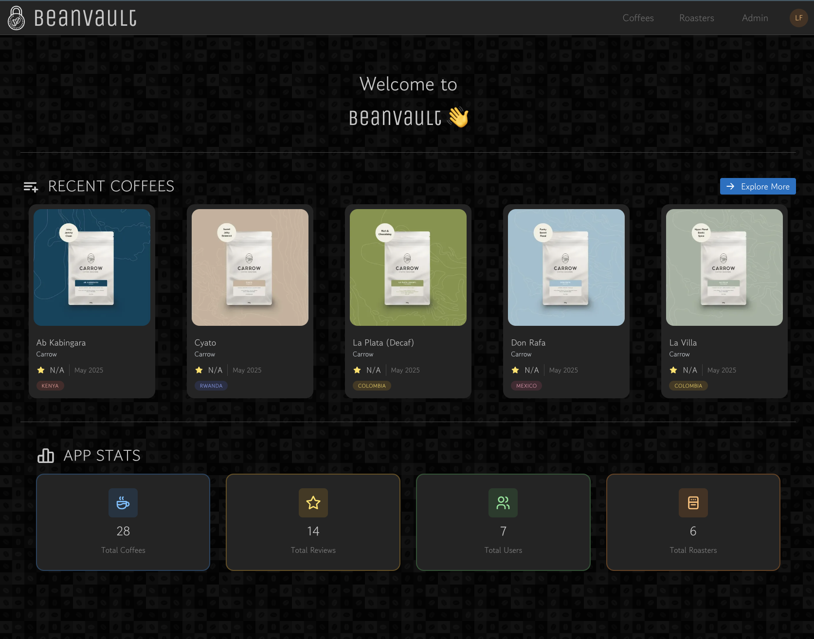
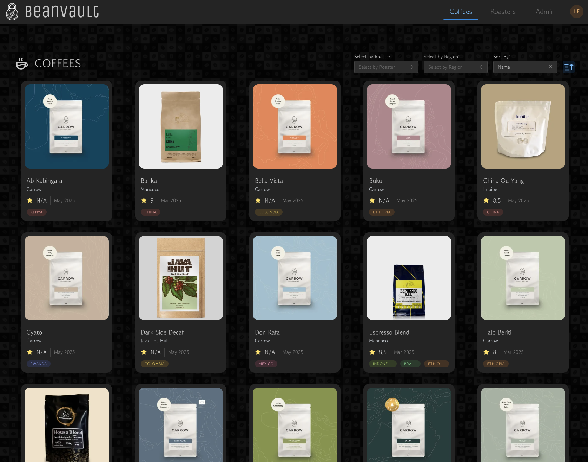
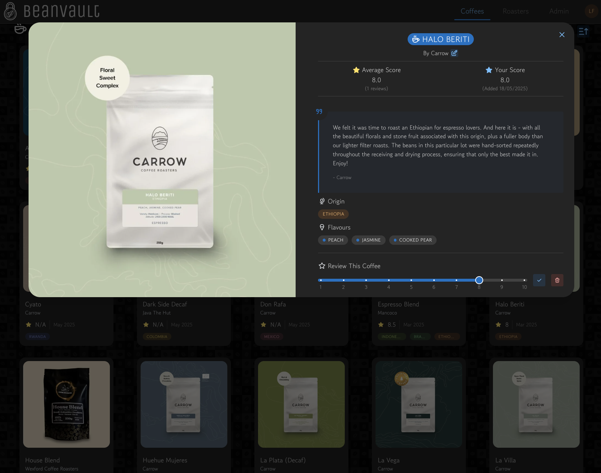
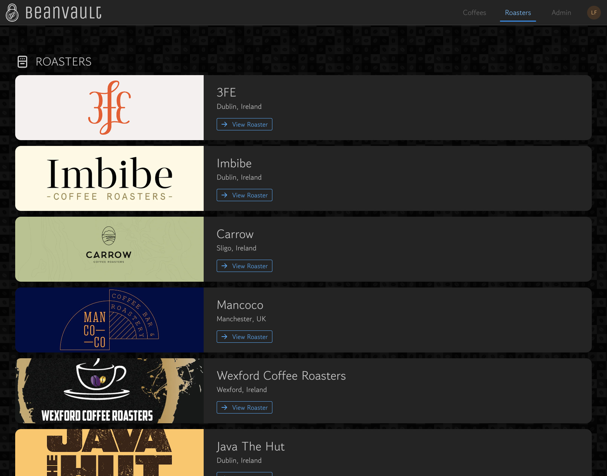

# Bean Vault

Bean Vault is a modern web application for coffee enthusiasts to discover, track, and review their favorite coffees. Built with React, Firebase, and Mantine UI.

| | |
|:---:|:---:|
|  |  |
|  |  |

## Features

- 📱 Responsive design that works on all devices
- 🔍 Browse and search through a curated collection of coffees
- ⭐ Rate and review your coffee experiences
- 📊 Track your coffee journey with detailed statistics
- 🏪 Explore different roasters and their offerings
- 🌍 Discover coffees from various regions
- 🎨 Beautiful, modern UI with dark/light mode support
- 👑 Admin dashboard for managing coffees, roasters, and regions
- 🤖 AI-powered coffee description optimization
- 🔄 Automated coffee data scraping from roaster websites

## Tech Stack

- **Frontend**: React + Vite
- **Image Handling**: Cloudinary
- **UI Framework**: Mantine UI
- **Scraping**: Crawl4AI
- **Backend**: Firebase
  - Authentication
  - Firestore Database
  - Cloud Functions

## License

This project is licensed under the MIT License - see the [LICENSE](LICENSE) file for details.
